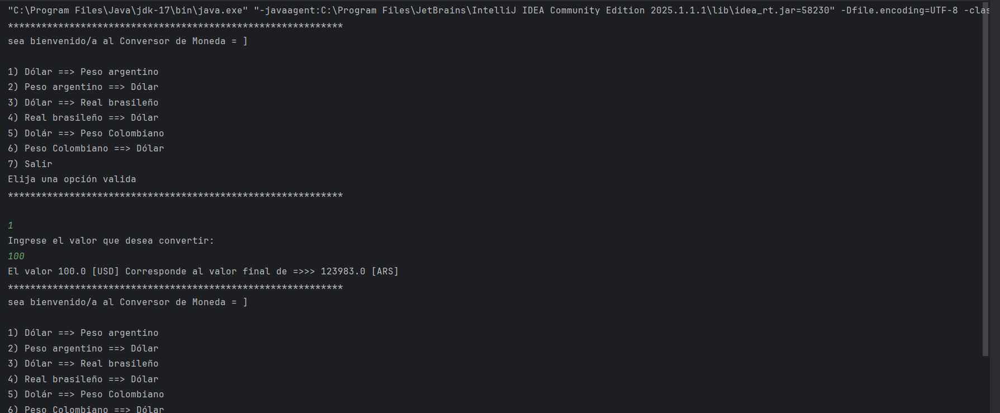

<h1>Conversor de moneda</h1>

Proyecto que se creo con el objetivo de realizar la conversión de moneda utilizando la API
https://v6.exchangerate-api.com/v6/

La funcionalidad se encuentra implementada en la clase ConversorMoneda

La clase Principal contiene un ejemplo de implemntación con
un menu interactivo.

El menu anterior contiene varias opciones de conversión de moneda
con la posibilidad de ampliación.
